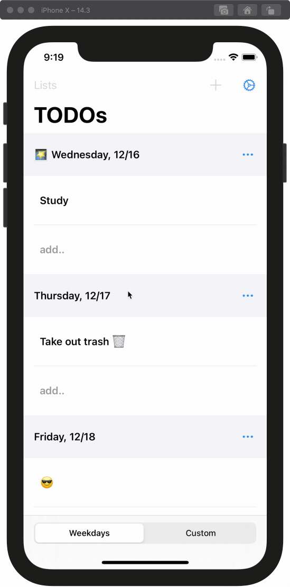

# TODOs

Daily TODOs in my preferred style: separate lists for each day of the week plus custom made lists. I used to fill a page of a notebook each day writing and crossing out completed items, completed days, etc. This works much better in an App: days automatically update, no need to re-write items that weren't completed on a given day, etc. I'm also using much less paper than I was with a notebook :recycle:. I miss the doodles though.

## Ideas/Checklist

- [ ] Custom drag and drop of rows and sections
- [ ] Backup to iCloud?
- [ ] App Icon (dark + light)
- [ ] 💡 UITableViewDiffableDataSource w/ dynamic section names and cases basically for custom named lists (not sure how to do currently)
- [ ] Show completed items in a list similar to Trello

## App Store

Please feel free to clone/copy/use any of the code in this project, just don't upload this straight to the App Store.
